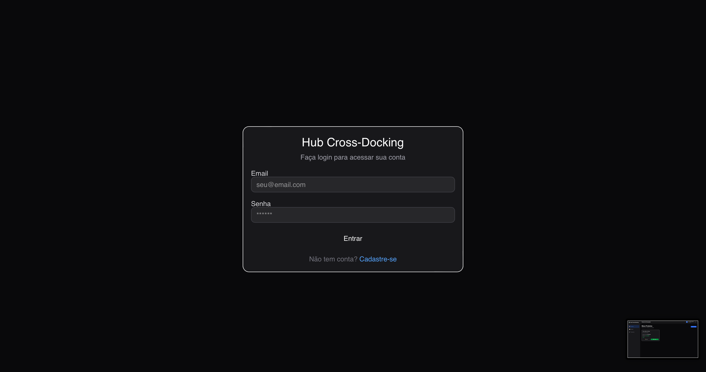
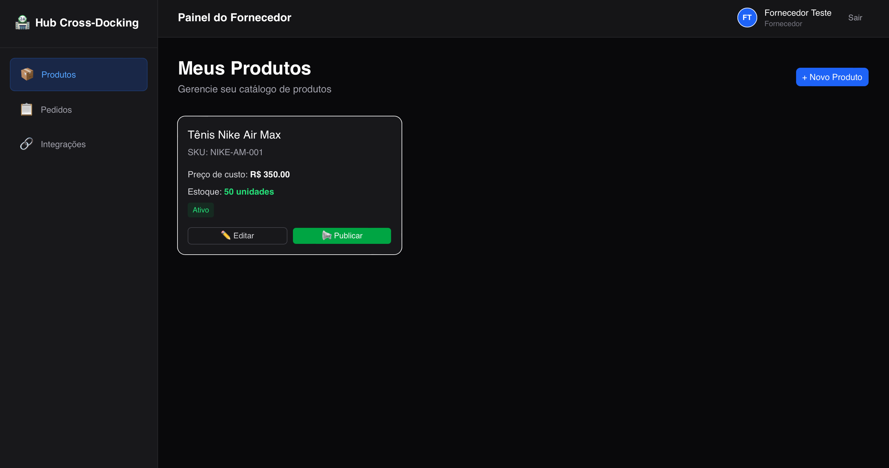

# 🏪 Hub Cross-Docking - Mercado Livre

**Hub de Cross-Docking e Dropshipping Nacional** integrado ao ecossistema do 
**Mercado Livre**.

---

## 📸 Screenshots

| Login | Dashboard |
|-------|-----------|
|  |  |

---

## 🚀 Funcionalidades

- Autenticação JWT com bcrypt
- CRUD de Produtos
- OAuth 2.0 Mercado Livre
- Criptografia AES-256-GCM
- Webhook de Pedidos
- Publicação automática de anuncios

---

## 🛠️ Stack

**Backend:** Node.js, TypeScript, Express, Prisma, PostgreSQL (Neon)
**Frontend:** Next.js 16, Tailwind CSS, Shadcn UI, Zustand

---

## 🚀 Como Rodar

Backend:
cd backend
npm install
npx prisma generate
npx prisma db push
npx tsx src/server.ts

Frontend:
cd frontend
npm install
npm run dev

---

## 👤 Autor

**Samuel Ventura** ([@Samu0440](https://github.com/Samu0440))
FIM
